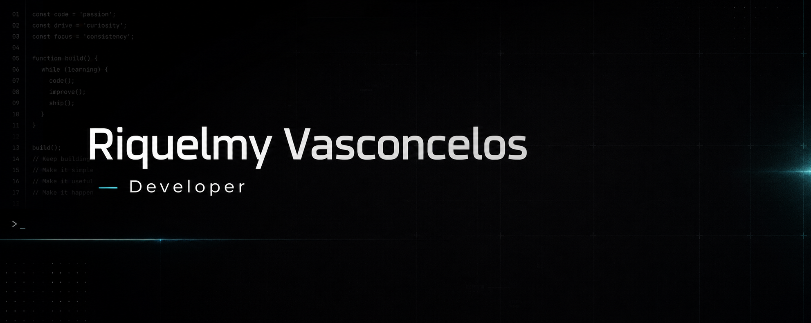
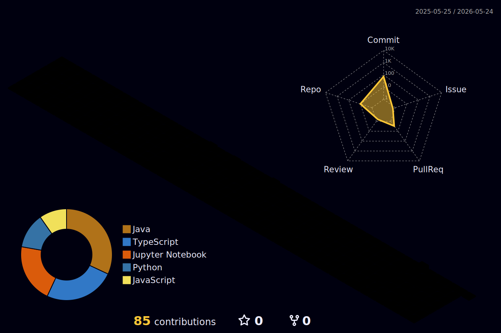

  

  Curioso por natureza e movido por aprendizado continuo. Gosto de entender como as coisas funcionam e transformar ideias em software util.

  

  
  
  

---

## Sobre mim

- Sou movido por curiosidade e gosto de entender a logica por tras das coisas.
- Estou construindo projetos para transformar ideias em aplicacoes reais, uteis e bem apresentadas.

---

## Tecnologias

  

---

## GitHub em numeros

  
  

---

## Contribuicoes 3D

  

---

## Projetos em destaque

### traby

Projeto em destaque que representa minha busca por criar solucoes reais, com foco em produto, tecnologia e utilidade pratica.

  

